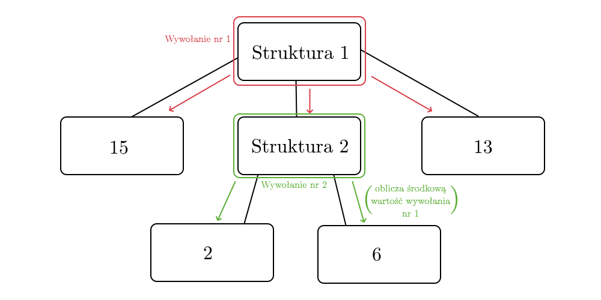

# Rekurencja

**Funkcja rekurencyjna** to funkcja, która uruchamia samą siebie. Pytanie brzmi - kiedy takie funkcje są nam potrzebne?

## Po co nam rekurencja?

Wyobraźmy sobie, że analizujemy strukturę. Jej wartość określa się, jako sumę jej wartości. Wartościami struktury mogą być liczby, albo inne struktury. Program, który obliczyłby wartość danej struktury, musiałby zsumować jej wartości. Co jeśli wartość jest mu nie znana - musi ją pozyskać, a więc zsumować jej wartości. Co jeśli wartością tej kolejnej struktury
jest jeszcze kolejna struktura? Znowu musimy pozyskać jej wartość. Cały proces się zapętla, a program może zrobić się bardzo skomplikowany. Funkcja rekurencja rozwiązuje ten problem. Najpierw implementujemy jej działanie dla *idealnej* struktury, czyli takiej, której wartościami są jedynie liczby. Teraz dodajemy warunek, jeżeli jakąś wartością struktury jest inna struktura, uruchom się dla niej. Dzięki temu, niezależnie czy ta głębsza struktura będzie idealna czy nie, funkcja poprawnie obliczy jej wartość. Jeśli bowiem natrafi na kolejną strukturę, wywoła się dla niej - niezależnie od tego jak bardzo *zagnieżdżone* są te struktury, funkcja ta policzy wszystkie ich wartości. 



Wartością struktury 1 zostanie 36, gdyż struktura 2 zwróci wartość 8.

## Rekurencja w praktyce

<a href="https://pl.wikipedia.org/wiki/Ci%C4%85g_Fibonacciego" target="_blank">Ciąg Fibonacciego</a> to popularna sekwencja liczb, w której \(fib(N)\) jest sumą \(fib(N-1) + fib(N-2)\). Jak się okazuje, jest to dokładnie to, czym jest rekurencja. Napiszmy taką funkcję.

```cpp
int fib(int n)
{
	return fib(n-1) + fib(n-2);
}
```

Piękna informatyczna reprezentacja matematycznej formuły określającej ciąg Fibonacciego. Niestety, uruchomiona raz, **nigdy się nie zakończy.** Nie istnieje bowiem \(fib(0), fib(-1), fib(-2), \dots\), a nasz program własnie to będzie próbował obliczyć. Należy więc dodać warunek, który poda programowi podstawowe wartości: \(fib(1)\) oraz \(fib(2)\).

```cpp
int fib(int n)
{
	if (n == 1) {
		return 1;
	} else if (n == 2) {
		return 1;
	} else {
		return fib(n-1) + fib(n-2);
	}
}
```

Funkcję tę można uprościć do następującego zapisu:

```cpp
int fib(int n)
{
	if (n <= 2)
		return 1;
	return fib(n-1) + fib(n-2);
}
```

## Ograniczenia rekurencji

Największym problemem rekurencji jest zużycie pamięci. Gdy wykorzystana wcześniej jako przykład funkcja `fib` wywoła kolejną funkcję, jej zmienna `n` cały czas pozostanie w pamięci komputera. Wywołana funkcja `fib` również będzie miała zmienną `n`, a więc mamy już dwie zmienne. Każdy kolejny `fib` będzie trzymał kolejną `n` - w przypadku większych programów pamięć bardzo szybko może się wypełnić, prowadząc do błędu `stack overflow` (przepełnienia pamięci na stosie).

## Podsumowanie

Dzisiaj nauczyłeś się używania funkcji rekurencyjnych. Wiesz, dlaczego je stosujemy, zrozumiałeś w jakich rzeczywistych problemach rekurencja może okazać się pomocna oraz poznałeś zagrożenia płynące z używania rekurencji w nieprzemyślany sposób.
